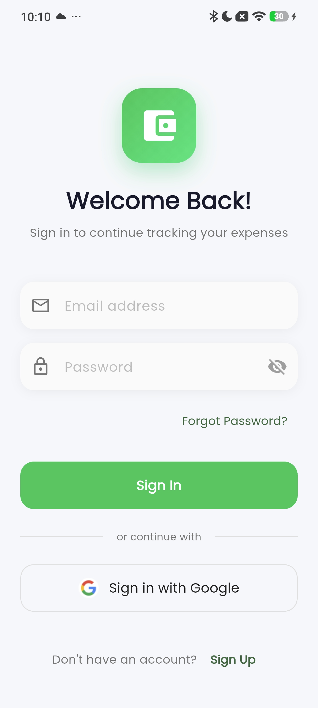
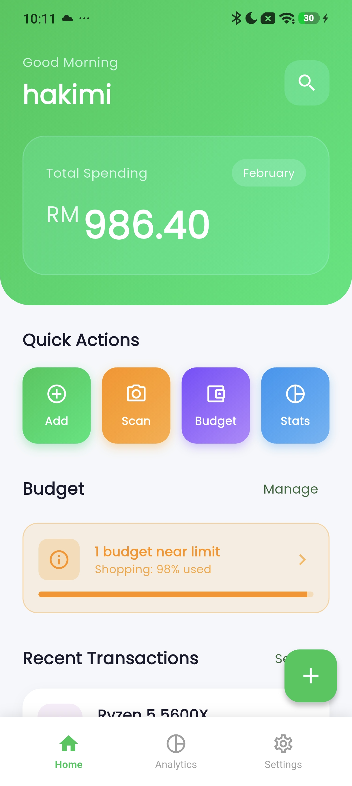
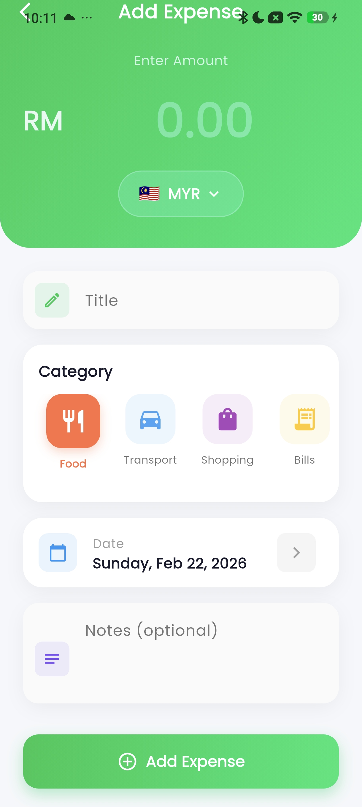
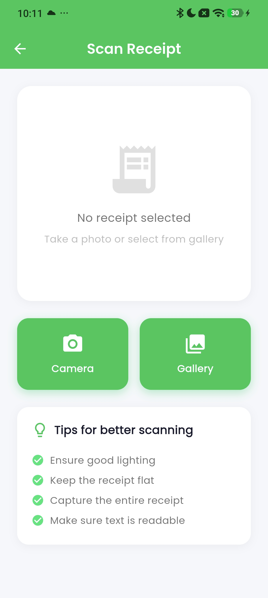
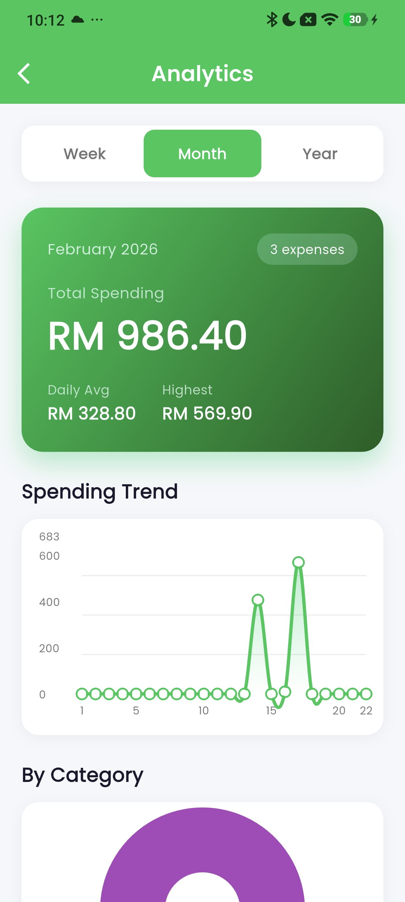
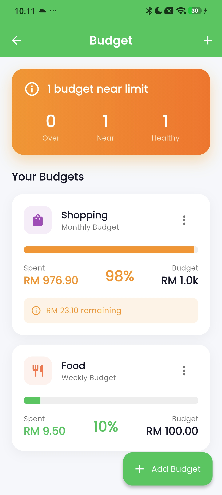
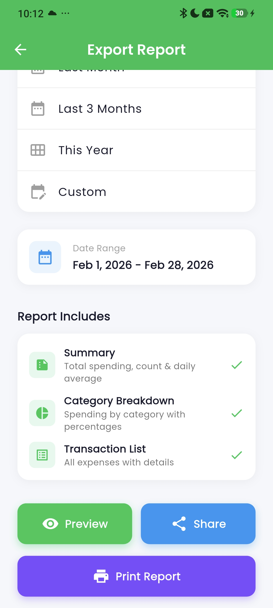

# SmartExpense 💰

A modern expense tracking app built with Flutter & Firebase.

## ✨ Features

- 🔐 Authentication (Email & Google Sign-In)
- 💰 Expense tracking with CRUD operations
- 📸 Receipt scanning with OCR
- 🧠 Smart category suggestions
- 💱 Multi-currency support (12 currencies)
- 📊 Analytics dashboard with charts
- 📄 PDF report generation
- 💵 Budget tracking & alerts
- 🌙 Dark mode
- ✨ Smooth animations & haptic feedback

## 📱 Screenshots

| Login | Dashboard | Add Expense | Scan Receipt |
|-------|-----------|-------------|--------------|
|  |  |  |  |

| Analytics | Budget | PDF Generator |
|-----------|--------|---------------|
|  |  |  |

## 🛠️ Tech Stack

| Technology | Purpose |
|------------|---------|
| Flutter/Dart | Framework |
| Firebase Auth | Authentication |
| Cloud Firestore | Database |
| Google ML Kit | OCR Scanning |
| Provider | State Management |
| FL Chart | Analytics Charts |

## 📥 Download

[⬇️ Download APK](https://github.com/YOUR_USERNAME/smartexpense/releases/download/v1.0.0/app-release.apk)

## 🚀 Installation

1. Clone this repository
```bash
git clone https://github.com/YOUR_USERNAME/smartexpense.git
```

2. Install dependencies
```bash
flutter pub get
```

3. Add your `google-services.json` from Firebase to `android/app/`

4. Run the app
```bash
flutter run
```

## 📋 Project Structure
```
lib/
├── config/          # Theme configuration
├── models/          # Data models
├── screens/         # UI screens
├── services/        # Business logic
└── widgets/         # Reusable components
```

## 👨‍💻 Developer

**Mohd Nur Hakimi bin Asmadi**  
Hakimi Dev

---

⭐ Star this repo if you find it useful!
```

---

### **Folder Structure:**

Make sure your screenshots are in:
```
smartexpense/
├── screenshots/
│   ├── Login.jpg
│   ├── Dashboard.jpg
│   ├── Add_expense.jpg
│   ├── Scan_receipt.jpg
│   ├── Analytics.jpg
│   ├── Budget.jpg
│   └── PDF_generator.jpg
├── README.md
└── ...